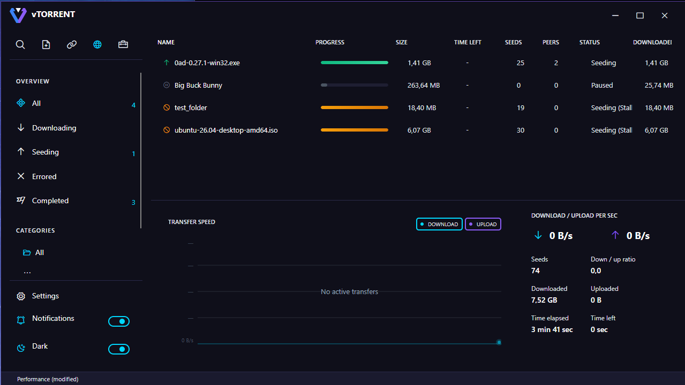
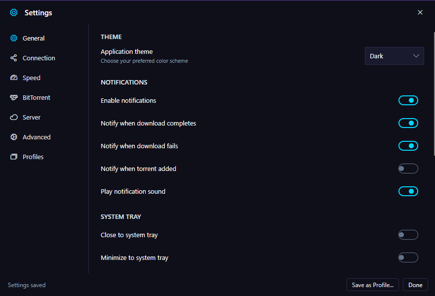
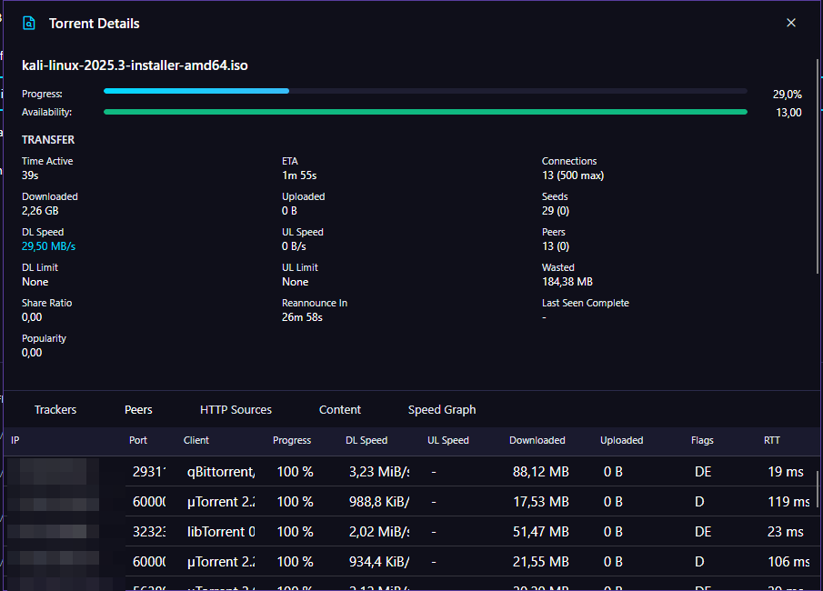
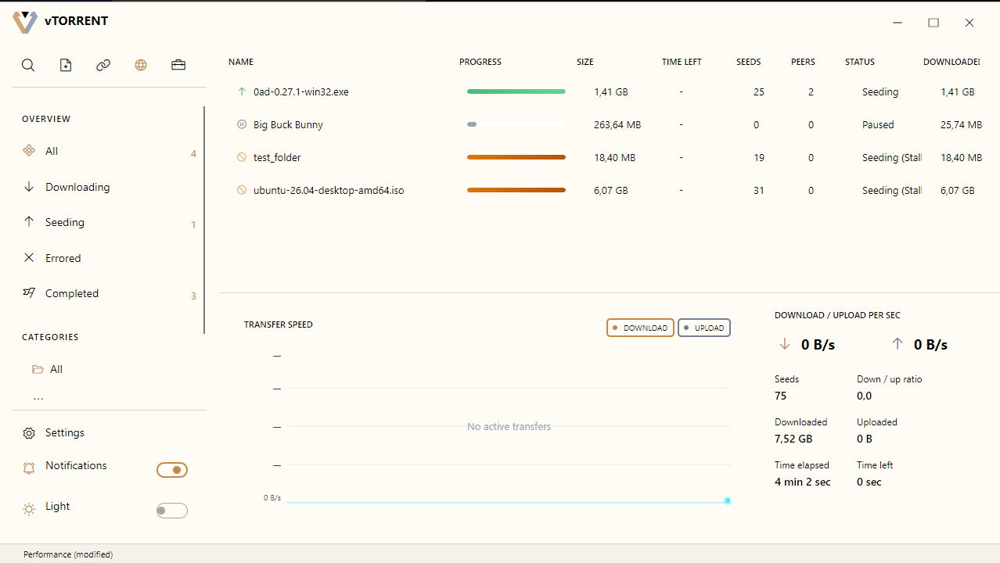

<div align="center">

# vTorrent

**A modern, full-featured, cross-platform BitTorrent client.**

Built with .NET 10, [Avalonia](https://avaloniaui.net/), and an MVVM architecture.

[](LICENSE)
[](https://github.com/Theodor908/vTorrent/actions/workflows/ci.yml)
[](https://github.com/Theodor908/vTorrent/actions/workflows/release.yml)
[](https://dotnet.microsoft.com/)


</div>

---

> ⚠️ **Disclaimer:** vTorrent is provided "as is", without warranty of any kind, and is intended only for transferring content you are legally entitled to share. Use at your own risk — see [Disclaimer](#disclaimer) for details.

<div align="center">



</div>

## Overview

vTorrent is a desktop BitTorrent client that implements a large surface of the
BitTorrent protocol and its extensions, with an emphasis on correctness,
performance, and a clean, responsive UI. The engine is designed around modern
async patterns and a coordinator-based architecture for piece selection,
choking, and peer/tracker communication.

## Features

- **Core protocol (BEP 3)** — full peer wire protocol, piece verification, endgame mode
- **DHT (BEP 5)** — trackerless peer discovery
- **Magnet links (BEP 9)** — metadata exchange, start a download from a magnet URI
- **uTP transport (BEP 29)** — LEDBAT congestion control, automatic TCP fallback
- **Web seeds (BEP 17 / BEP 19)** — HTTP/URL-based seeding
- **Resume data** — fast resume across restarts
- **Bandwidth management** — global and per-torrent rate limits
- **Auto-management queue** — active download/seed limits, automatic queueing
- **Selective & priority downloading** — choose files and set piece priorities
- **Cross-platform sparse file allocation**
- **Desktop notifications** and **light / dark theming**

## Screenshots

|                          Settings                          |                       Peer details                       |                        Light theme                        |
| :--------------------------------------------------------: | :------------------------------------------------------: | :-------------------------------------------------------: |
|  |  |  |

## Supported Platforms

| OS      | Architectures   |
| ------- | --------------- |
| Windows | x64             |
| Linux   | x64, arm64      |
| macOS   | x64, arm64      |

## Download

Pre-built, self-contained binaries for each platform are attached to every
[GitHub Release](https://github.com/Theodor908/vTorrent/releases). No runtime
installation is required — just unpack and run.

## Building from Source

### Prerequisites

- [.NET 10 SDK](https://dotnet.microsoft.com/download) (the repo pins the version via `global.json`)

### Build & Run

```bash
# Clone
git clone https://github.com/Theodor908/vTorrent.git
cd vTorrent

# Restore & build the whole solution
dotnet build vTorrent.sln -c Release

# Run the desktop app
dotnet run --project src/vTorrent.Desktop -c Release

# (Optional) run the CLI
dotnet run --project src/vTorrent.CLI -c Release

# Run the test suite
dotnet test vTorrent.sln
```

## Project Layout

```
src/
  vTorrent.Abstractions/   Interfaces, DTOs, settings, enums (no dependencies)
  vTorrent.Core/           Engine, orchestration, DHT, download/upload, peers, trackers
  vTorrent.Bencode/        Span-based zero-copy bencode parsing
  vTorrent.Storage/        Persistence (SQLite + Dapper)
  vTorrent.Desktop/        Avalonia UI, ViewModels, services
  vTorrent.CLI/            Command-line client
  vTorrent.Server/         Headless / server mode
tests/                     Unit & integration tests per subsystem
packaging/                 Platform packaging assets
```

## Contributing

Contributions are welcome! Please read [CONTRIBUTING.md](CONTRIBUTING.md) and our
[Code of Conduct](CODE_OF_CONDUCT.md) before opening a pull request.

## Security

Found a vulnerability? Please **do not** open a public issue — see
[SECURITY.md](SECURITY.md) for private reporting instructions.

## Disclaimer

**Software quality.** vTorrent is under active development and is provided **"as is", without warranty of any kind**, express or implied. It may contain bugs, behave unexpectedly, or fail to work as intended, and it could in some cases lead to data loss or corruption. The entire risk as to the quality and performance of the software is with you. To the maximum extent permitted by law, the author shall not be liable for any damages of any kind arising from the use of this software. See sections **15 (Disclaimer of Warranty)** and **16 (Limitation of Liability)** of the [GNU GPL v3](LICENSE) for the full legal terms.

**Lawful use only.** vTorrent is a general-purpose BitTorrent client. The BitTorrent protocol itself is a neutral, legal file-transfer technology. This software is intended **solely for downloading, sharing, and distributing content that you have the legal right to transfer** — for example, your own files, public-domain works, open-source distributions, and other freely licensed material.

You are solely responsible for how you use vTorrent and for ensuring your use complies with all applicable laws and regulations in your jurisdiction, including copyright law. **The author does not condone, encourage, or take any responsibility for copyright infringement or any other unlawful use of this software.** Any misuse is entirely the responsibility of the user.

## License

vTorrent is free software, licensed under the
**[GNU General Public License v3.0](LICENSE)**.

```
Copyright (C) 2026 Vasile Theodor-Gabriel

This program is free software: you can redistribute it and/or modify it under
the terms of the GNU General Public License as published by the Free Software
Foundation, either version 3 of the License, or (at your option) any later
version. This program is distributed WITHOUT ANY WARRANTY; see the GNU General
Public License for more details.
```

## Acknowledgments

Built on the shoulders of excellent open-source projects, including
[Avalonia](https://avaloniaui.net/),
[CommunityToolkit.Mvvm](https://github.com/CommunityToolkit/dotnet),
[Dapper](https://github.com/DapperLib/Dapper), and the BitTorrent BEP
specifications.
